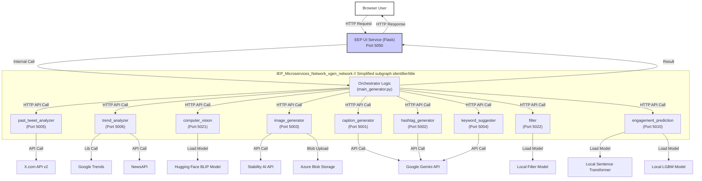

# X-Content-Generation

## Overview

X-Content-Generation is a powerful application designed to assist users in creating engaging content suggestions for X.com (formerly Twitter). It leverages a suite of specialized AI/ML microservices orchestrated by a central web UI to analyze context, generate text and images, filter content, and predict engagement.

The goal is to provide users with high-quality, contextually relevant post suggestions tailored to their profile and desired topic, potentially including generated visuals.

## Features

*   **Contextual Analysis:**
    *   Analyzes past user tweets (style, tone, topics, hashtags, emojis) via the X API (requires Bearer Token). Handles user not found or insufficient tweet scenarios gracefully.
    *   Fetches current trending topics and news via Google Trends and NewsAPI.
*   **Content Generation:**
    *   Generates tweet captions using Google Gemini, considering user style, topic, trends, and image context.
    *   Generates relevant hashtags using keyword extraction (YAKE!) and LLM refinement (Google Gemini).
    *   Suggests improved keywords based on initial input, WordNet enrichment, and LLM refinement (Google Gemini).
    *   Generates images relevant to the topic/prompt using Stability AI (if no user image is provided).
*   **Content Enhancement & Analysis:**
    *   Describes user-uploaded images using a Computer Vision model (Hugging Face BLIP).
    *   Filters generated text content for appropriateness using a custom Hugging Face classification model.
    *   Predicts the relative engagement score of generated post candidates using a machine learning model (LightGBM + Sentence Transformer).
*   **Orchestration & UI:**
    *   A Flask-based web UI allows users to input parameters (username, keyword, theme, optional image).
    *   The backend orchestrates calls to the various IEP microservices.
    *   Selects the best post candidate based on filter status and predicted engagement, with fallback logic.
    *   Displays the final suggestion and intermediate results.
*   **Microservice Architecture:** Built using Docker and Docker Compose, with each IEP running as a separate containerized Flask application.

## Architecture

The application follows a microservice architecture:

1.  **EEP UI (External Endpoint UI):** A Flask web application (`eep_ui` service in Docker Compose) that serves the user interface. It receives user input, calls the orchestrator logic internally, and displays the results.
2.  **Orchestrator Logic:** Python functions (`main_generator.py` module) imported and executed by the EEP. This logic coordinates the calls to various IEPs in a defined workflow.
3.  **IEPs (Internal Endpoints):** Individual Flask microservices, each responsible for a specific task (e.g., `caption_generator`, `image_generator`, `filter`, `past_tweet_analyzer`). They communicate via HTTP REST APIs.
4.  **Docker Compose:** Used to define, build, and run the multi-container application stack.
5.  **Network:** All services communicate over a shared Docker bridge network (`xgen_network`).



## Tech Stack

*   **Backend Framework:** Python, Flask
*   **Containerization & Orchestration:** Docker, Docker Compose
*   **AI/ML Models & Libraries:**
    *   Google Gemini API (via `google-generativeai`)
    *   Stability AI API (via `requests`)
    *   Hugging Face Transformers (`transformers`, `torch`)
        *   BLIP (Computer Vision)
        *   Custom Sequence Classification (Filter)
        *   Sentence Transformers (Engagement Prediction)
    *   LightGBM (Engagement Prediction)
    *   NLTK (Keyword Enrichment - WordNet)
    *   YAKE! (Keyword Extraction)
    *   Scikit-learn, Pandas, Numpy (Data Handling/ML)
*   **External APIs:**
    *   X.com API v2 (via `tweepy`)
    *   NewsAPI (via `newsapi-python`)
    *   Pytrends (Google Trends)
*   **Cloud Storage:** Microsoft Azure Blob Storage (via `azure-storage-blob`)
*   **Frontend:** HTML, CSS (via Jinja2 templates in Flask)
*   **Other:** `requests`, `python-dotenv`, `joblib`

## Project Structure
```
X-Content-Generation/
├── .github/ # CI/CD workflows (e.g., deployment)
│ └── workflows/
│ └── deploy.yml
├── EEP/ # External Execution Platform (UI + Orchestrator)
│ ├── Dockerfile # Builds the eep_ui service
│ ├── requirements.txt # Python deps for UI and Orchestrator logic
│ ├── ui.py # Flask UI application code
│ ├── orchestrator/ # Orchestrator logic module
│ │ ├── init.py
│ │ └── main_generator.py # Core orchestration functions
│ ├── static/ # CSS files
│ │ └── style.css
│ └── templates/ # HTML templates
│ └── index.html
├── IEP/ # Intelligent Execution Primitives (Microservices)
│ ├── caption-generator/ # IEP for generating captions
│ │ ├── Dockerfile
│ │ ├── app.py
│ │ └── requirements.txt
│ ├── computer-vision/ # IEP for image description
│ │ ├── Dockerfile
│ │ ├── app.py
│ │ └── requirements.txt
│ ├── engagement-prediction/ # IEP for predicting engagement
│ │ ├── Dockerfile
│ │ ├── app.py
│ │ ├── requirements.txt
│ │ ├── models/ # Engagement ML model file(s)
│ │ └── text_encoder/ # Sentence Transformer model files
│ ├── filter/ # IEP for content filtering
│ │ ├── Dockerfile
│ │ ├── app.py
│ │ ├── requirements.txt
│ │ └── filtering_model/ # Filter model files
│ ├── hashtag-generator/ # IEP for generating hashtags
│ │ ├── Dockerfile
│ │ ├── app.py
│ │ └── requirements.txt
│ ├── image-generator/ # IEP for generating images
│ │ ├── Dockerfile
│ │ ├── app.py
│ │ └── requirements.txt
│ ├── keyword-suggester/ # IEP for suggesting keywords
│ │ ├── Dockerfile
│ │ ├── app.py
│ │ └── requirements.txt
│ ├── past-tweet-analyzer/ # IEP for analyzing user history
│ │ ├── Dockerfile
│ │ ├── app.py
│ │ └── requirements.txt
│ └── trend-analyzer/ # IEP for analyzing trends
│ ├── Dockerfile
│ ├── app.py
│ └── requirements.txt
├── data-processing/ # (Optional) Scripts for data tasks (e.g., scraping)
│ └── scraping.py
├── monitoring/ # (Placeholder) Configuration for monitoring tools
├── input/ # Local directory (create manually) - Not used by default run
├── output/ # Local directory (create manually) - Not used by default run
├── .gitignore # Specifies intentionally untracked files
├── .env # Local environment variables (API Keys - DO NOT COMMIT)
├── docker-compose.yml # Defines and configures all services
└── README.md # Main project README
```
# Setup and Local Execution Instructions

Follow these steps to configure, build, and run the entire application stack locally using Docker Compose.

## 1. Prerequisites

*   **Docker:** Ensure Docker Desktop (Windows/Mac) or Docker Engine (Linux) is installed and running.
*   **Docker Compose:** Ensure Docker Compose (v1 or v2) is installed.
*   **Git:** Ensure Git is installed to clone the repository.
*   **API Keys & Credentials:** Obtain the necessary API keys and credentials(Google AI, Stability AI, X.com Bearer Token, NewsAPI, Azure Storage Connection String & Container Name).
*   **Local Model Files:** Download or train the required local models and place them in the correct directories:
    *   `./IEP/engagement-prediction/models/engagement_model.pkl`
    *   `./IEP/engagement-prediction/text_encoder/` (directory containing Sentence Transformer files)
    *   `./IEP/filter/filtering_model/` (directory containing the filter model files)

## 2. Configuration (`.env` File)

1.  **Clone Repository:** If you haven't already, clone the project repository and navigate into the project root directory (`X-Content-Generation/`).
    ```bash
    git clone <your-repository-url>
    cd X-Content-Generation
    ```
2.  **Create/Populate `.env`:** Create a file named `.env` in the `X-Content-Generation/` root directory. **Important:** Add `.env` to your `.gitignore` file to prevent committing secrets.
3.  **Generate Flask Secret:** Create a strong random string for the Flask UI's secret key:
    ```bash
    # Using Python
    python -c 'import secrets; print(secrets.token_hex(24))'
    ```
4.  **Add Variables to `.env`:** Copy the generated secret key and your API credentials into the `.env` file:
    ```dotenv
    # --- API Keys ---
    GOOGLE_API_KEY=AIzaSy...your_google_api_key...
    STABILITY_API_KEY=sk-...your_stability_api_key...
    X_BEARER_TOKEN="AAAAAAAAAAAAAAAAAAAAA...your_x_bearer_token..."
    NEWS_API_KEY=your_news_api_key

    # --- Azure Storage ---
    AZURE_STORAGE_CONNECTION_STRING="DefaultEndpointsProtocol=https;AccountName=...your_connection_string..."
    AZURE_BLOB_CONTAINER_NAME=your_blob_container_name

    # --- Flask UI ---
    FLASK_SECRET_KEY=paste_your_randomly_generated_secret_key_here
    ```

## 3. Build the Docker Images

*   From the `X-Content-Generation/` root directory, run the build command:
    ```bash
    docker-compose build
    ```
    *   This process might take time on the first run. Monitor the output for errors.

## 4. Run the Application Stack

*   Once the build is successful, start all the services:
    ```bash
    docker-compose up -d
    ```
    *   The `-d` flag runs containers in the background.
    *   Wait for services to initialize (check logs if needed).

## 5. Access the Web UI

*   Open your web browser and navigate to:
    `http://localhost:5050`

## 6. Using the Application

*   Fill in the form fields: required **Username**, optional **Keyword/Topic**, optional **Image Upload**, select **Theme**.
*   Submit the form to generate content suggestions.
*   View the results displayed on the page.

## 7. Monitoring and Debugging

*   **View All Logs:**
    ```bash
    docker-compose logs -f
    ```
*   **View Specific Service Logs:**
    ```bash
    docker logs <container_name> -f
    ```
    (e.g., `docker logs eep_ui_service -f`, `docker logs filter_iep -f`)
*   **Check Running Containers:**
    ```bash
    docker ps
    ```

## 8. Stopping the Application

*   To stop and remove all containers, networks, etc.:
    ```bash
    docker-compose down
    ```

# Security Considerations

## API Keys and Credentials

*   Your API keys (Google, Stability, X, NewsAPI) and Azure Storage connection string are sensitive credentials.
*   The `.env` file is used to store these secrets locally for development via Docker Compose.
*   **Crucially, the `.env` file must NEVER be committed to version control (e.g., Git).**
*   Ensure `.env` is listed in your project's `.gitignore` file.
*   Use strong, unique keys/passwords for all external services.
*   Consider rotating API keys periodically according to the provider's recommendations.

## Flask Secret Key

*   The `FLASK_SECRET_KEY` stored in the `.env` file is used to sign session cookies (needed for flash messages).
*   It must be kept secret and should be a long, random, unpredictable string. Do not use default or easily guessable values.

## Production Environments

*   Storing secrets directly in `.env` files is suitable for local development but **not recommended for production**.
*   For production deployments, utilize a dedicated secrets management solution appropriate for your deployment environment, such as:
    *   HashiCorp Vault
    *   AWS Secrets Manager
    *   Azure Key Vault
    *   Google Secret Manager
    *   Environment variables injected securely by your CI/CD platform or orchestrator (e.g., Kubernetes Secrets, GitHub Actions Secrets).

## Input Validation

*   While some basic validation exists (e.g., file type), further server-side validation of user inputs (username format, keyword length/content, theme values) can enhance security and robustness.
*   The `werkzeug.utils.secure_filename` function is used for uploaded filenames, which is good practice.

## Filtering Service

*   The effectiveness and safety of the generated content rely heavily on the `filter` IEP. Ensure its model is robust and regularly evaluated. Be aware of potential bypasses or limitations of the filter model.